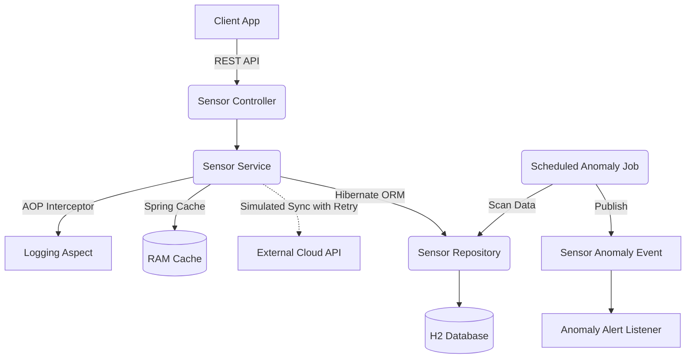

# Smart Building IoT API

A high-performance, fault-tolerant RESTful API built with **Spring Boot 3** and **Java 17** for managing and monitoring IoT sensors in smart buildings. 

This project demonstrates advanced software architecture patterns suitable for enterprise-grade applications, specifically targeted for IoT and Telemetry use cases.

<!-- PLACEHOLDER FOR MAIN BANNER IMAGE: Add your banner image here -->


## System Architecture

<!-- OVERALL ARCHITECTURE IMAGE PLACEHOLDER -->

*(Replace this placeholder with the Overall Architecture Image)*

### High-Level Architecture Flow
<!-- GitHub will render this Mermaid diagram automatically! -->


## Key Features & Component Flows

### 1. Event-Driven Architecture (EDA)
Uses Spring `ApplicationEventPublisher` to decouple anomaly detection from alert notification listeners. When a sensor detects high temperatures, an event is published asynchronously rather than blocking the main thread.

### 2. Fault Tolerance & Circuit Breaking
Leverages Spring Retry (`@Retryable`, `@Recover`) to handle transient network failures when syncing data with external cloud providers. If the External Cloud API is down, the system retries 3 times before triggering a fallback recovery method.

### 3. Aspect-Oriented Programming (AOP)
Implements cross-cutting concerns (`@Aspect`, `@Around`) for automated API performance profiling and execution time logging without cluttering business logic.

### 4. Data Caching & Telemetry
Integrates Spring Cache (`@Cacheable`, `@CacheEvict`) to reduce database load for frequent sensor data reads. Tracks sensor history (`@OneToMany`) and automates auditing (`@CreatedDate`, `@LastModifiedDate`).

## 🛠️ Technology Stack
- **Framework:** Spring Boot 3.2.x, Java 17
- **Database:** H2 In-Memory Database / Hibernate ORM
- **API Documentation:** OpenAPI 3.0 (Swagger UI)
- **Tooling:** Maven, Spring Actuator (DevOps Monitoring)

## How to Run Locally

1. Ensure you have **Java 17** installed.
2. Clone the repository.
3. Run the application using the Maven Wrapper:
   ```bash
   # On Windows
   .\mvnw.cmd spring-boot:run
   
   # On Mac/Linux
   ./mvnw spring-boot:run
   ```
4. Access the API Documentation and test the endpoints via Swagger UI:
   👉 **http://localhost:8080/swagger-ui.html**

<!-- PLACEHOLDER FOR SWAGGER SCREENSHOT: Add a screenshot of your Swagger UI here -->


## API Endpoints
- `GET /api/sensors` - Retrieve all sensors (Paginated)
- `GET /api/sensors/{id}` - Retrieve sensor details (Cached)
- `POST /api/sensors` - Register a new sensor
- `GET /api/sensors/{id}/average-reading` - Get telemetry analytics
- `POST /api/sensors/{id}/sync` - Push to cloud (Simulates Fault Tolerance/Retry)
